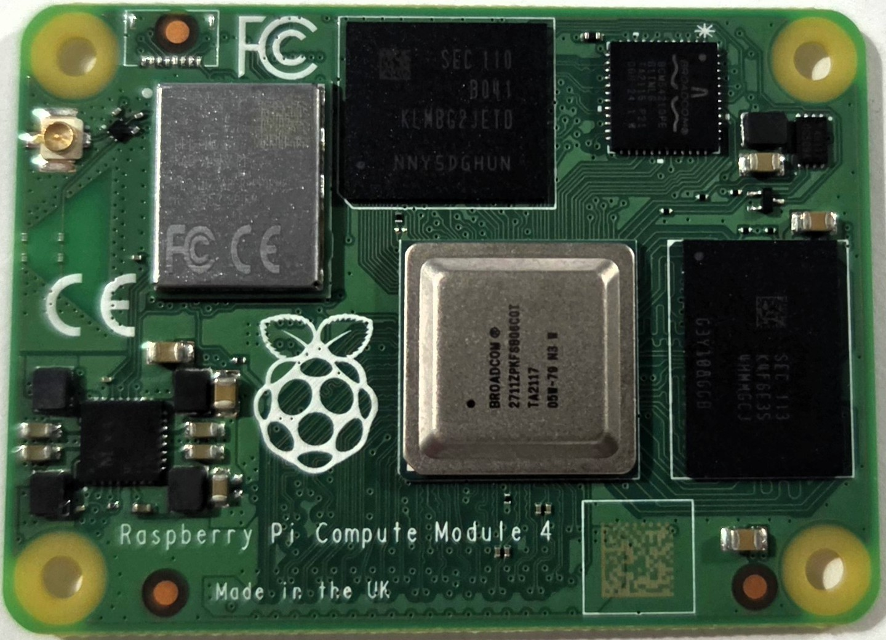

# Pi CM4

Repair reference data for Raspberry Pi Compute Module 4 boards.

The CM4 is a SODIMM-form-factor compute module based on the BCM2711 SoC (same as Pi 4). It does not use a "Model A" / "Model B" designation. Available in various RAM (1GB–8GB) and eMMC (0–32GB) configurations, plus a wireless variant (CM4S). Revisions reflect PCB-level hardware changes.

## Board Images

### Top

### Bottom

## Revision Identification

If the carrier board boots, the most reliable way to identify the revision is via software. See the [Board Identification guide](../guides/board-identification.md).

For non-booting modules, the following physical attributes can help narrow down the revision:

<!-- TODO: Add distinguishing physical attributes between revisions -->

## Revisions

| Revision | Key Changes  |
|----------|-------------|
| [Rev 1.0](rev-1.0/index.md) | Initial release  |
