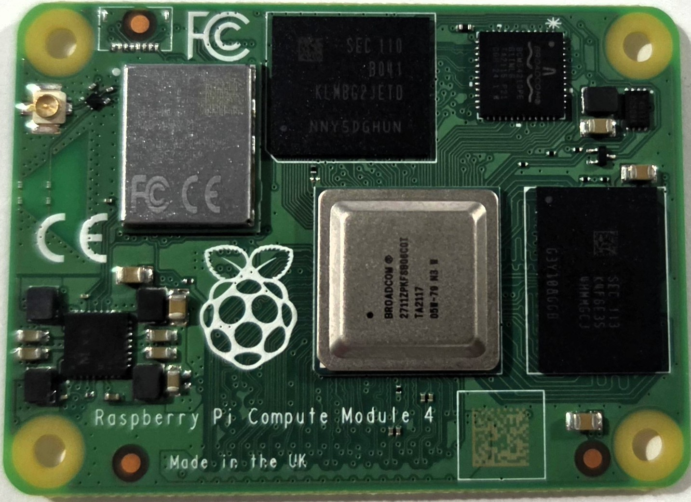
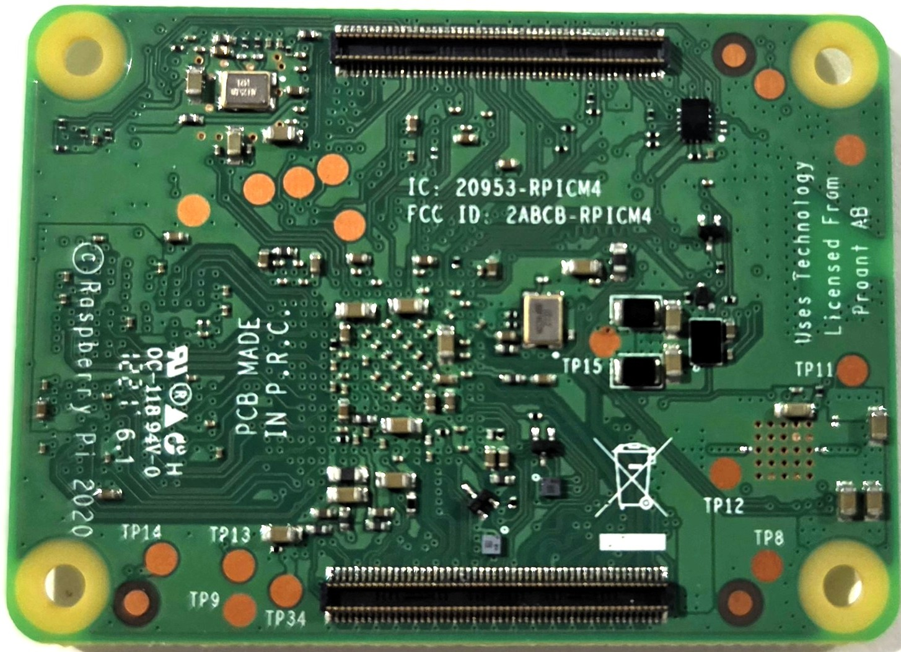

<!-- TODO: Populate component table for Pi CM4 -->

# Pi CM4 Rev 1.0 Components

## Top

<!-- TODO: Annotate with component numbers once board images are marked up -->

## Bottom

<!-- TODO: Annotate with component numbers once board images are marked up -->
