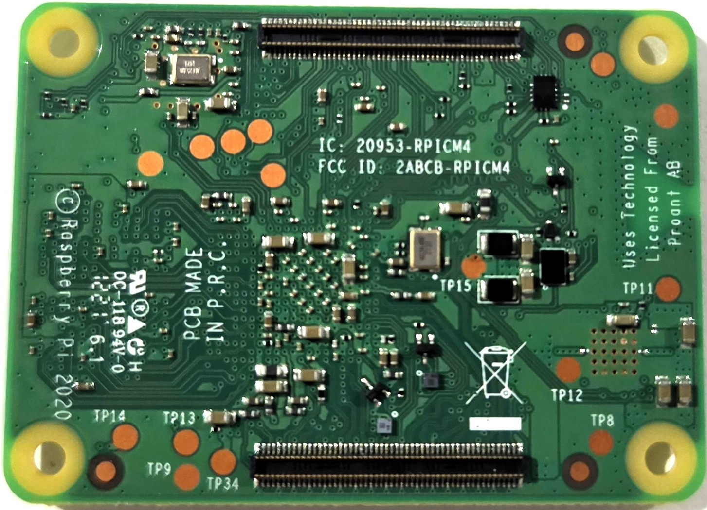

# Pi CM4 Rev 1.0 - Test Points

<!-- TODO: Fill in test point data for Pi CM4 Rev 1.0 -->

## Board Image

## Readings

* `Powered` - These measurements were taken with the board plugged in/powered on, and
  *nothing* else plugged in including no SD Card inserted
* `OS Idle` - These measurements were taken with the board booted into Raspberry PI OS.
  These tests are different from Power Only in that the SD card is inserted
  and we have booted from it.
* `Resistance` - These measurements were taken **without** power. This is a measurement
  of resistance to ground from the given test point.

| Test Point | Zone | Powered | OS Idle | Resistance |
|------------|------|---------|---------|------------|
| | | | | |
