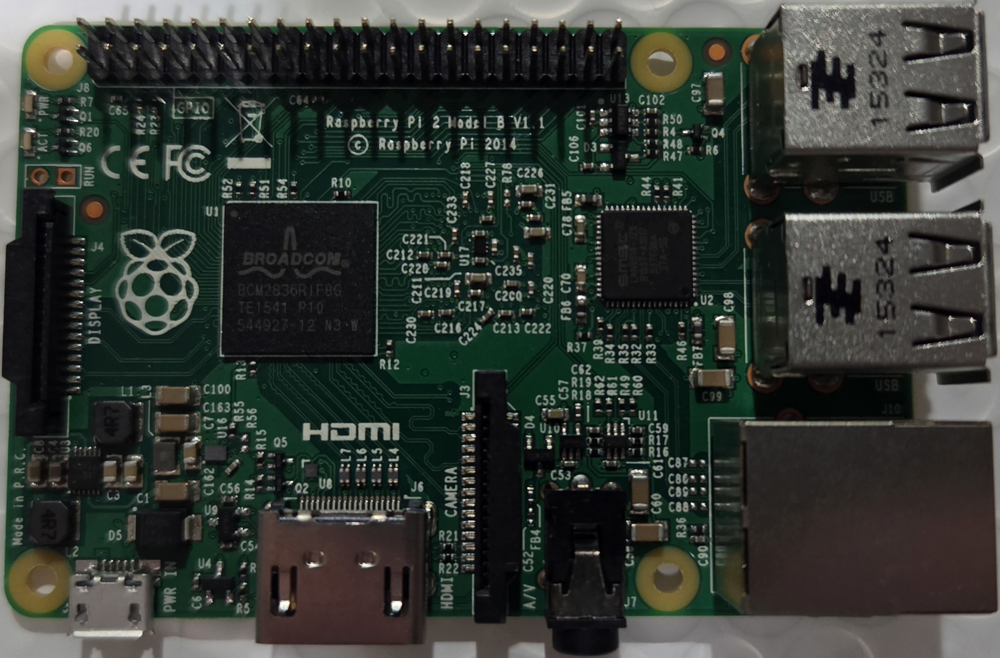
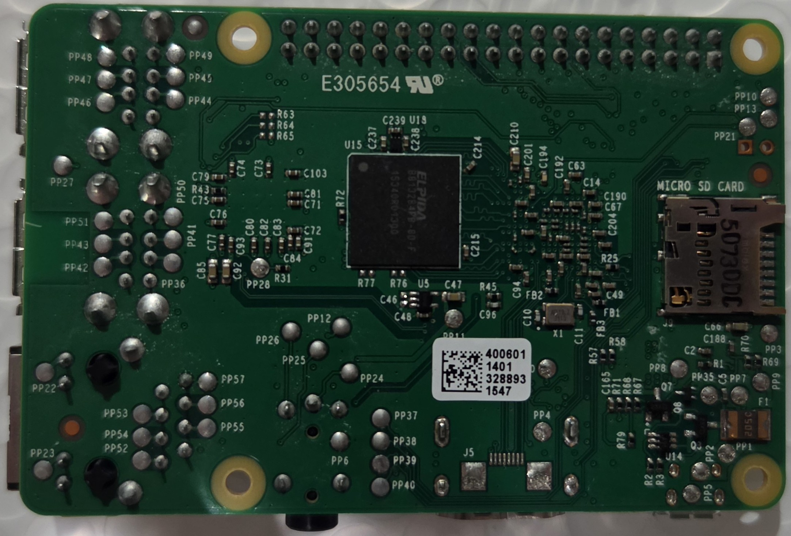

# Pi 2 Model B - Rev 1.1

Board-level repair reference for the Raspberry Pi 2 Model B, PCB revision 1.1.

  <figure style="flex: 1; min-width: 200px; margin: 0;">
    
    <figcaption style="text-align: center; font-size: 0.8rem;">Top</figcaption>
  </figure>
  <figure style="flex: 1; min-width: 200px; margin: 0;">
    
    <figcaption style="text-align: center; font-size: 0.8rem;">Bottom</figcaption>
  </figure>

## Identification

- **Revision codes:** a01041 (Sony, UK), a21041 (Embest, China)
- **Release:** February 2015
- **SoC:** BCM2836

## Sections
- [Test Points](test-points.md) - Test point map and expected readings

---

*Want to help fill in this page? See [Contributing](/contributing/).*
