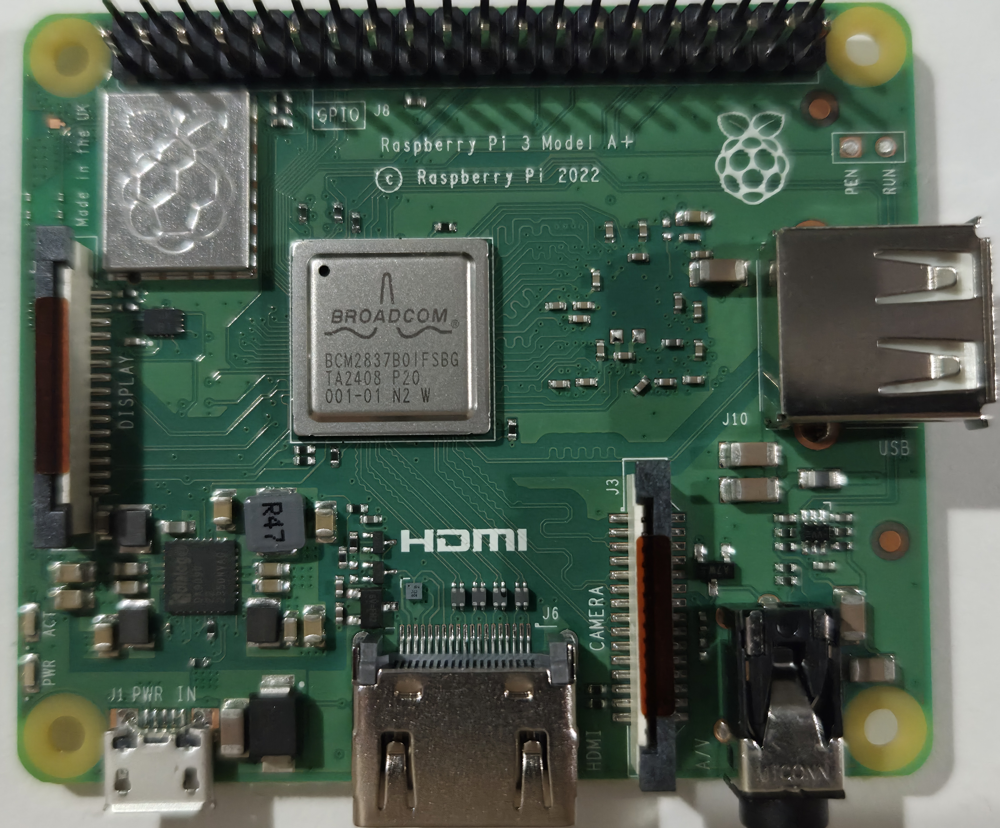
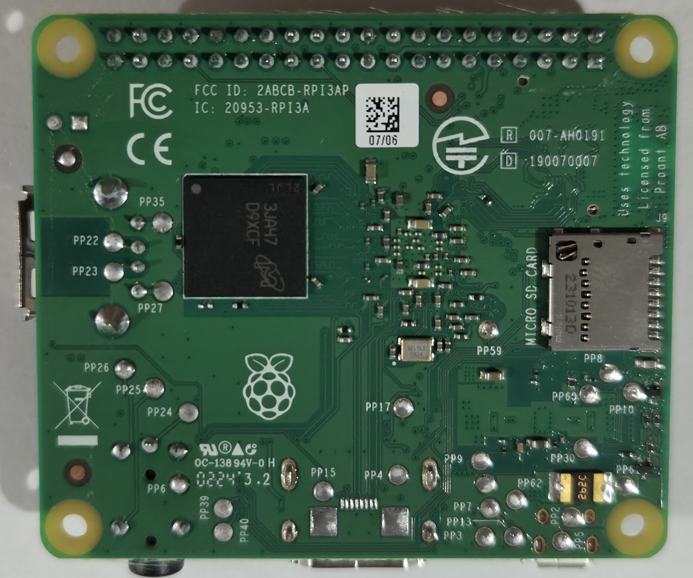

# Pi 3 Model A+ - Rev 1.0

Board-level repair reference for the Raspberry Pi 3 Model A+, PCB revision 1.0.

  <figure style="flex: 1; min-width: 200px; margin: 0;">
    
    <figcaption style="text-align: center; font-size: 0.8rem;">Top</figcaption>
  </figure>
  <figure style="flex: 1; min-width: 200px; margin: 0;">
    
    <figcaption style="text-align: center; font-size: 0.8rem;">Bottom</figcaption>
  </figure>

## Identification

- **Revision codes:** 9020e0 (Sony, UK)
- **Release:** November 2018
- **SoC:** BCM2837B0
- **Notes:** Smaller form factor, no Ethernet, single USB port, 512MB RAM

## Sections
- [Test Points](test-points.md) - Test point map and expected readings

---

*Want to help fill in this page? See [Contributing](/contributing/).*
