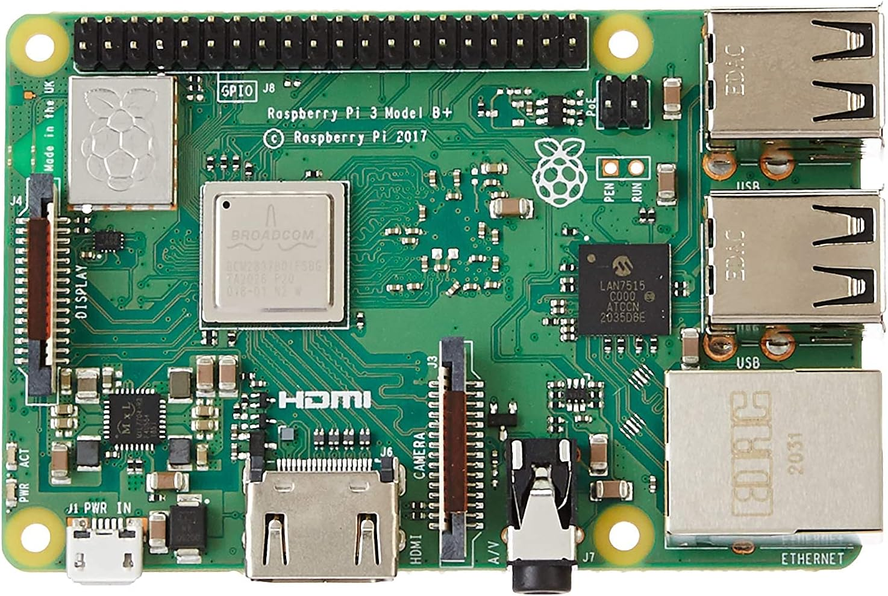
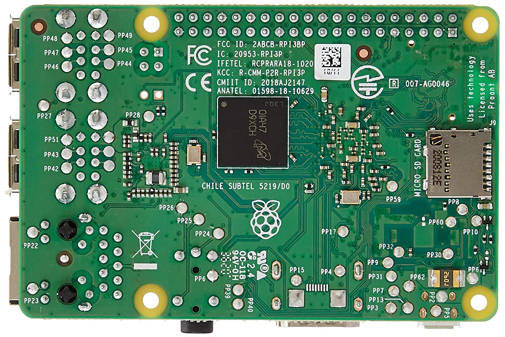

# Pi 3 B+ Rev 1.3 Components

## Legend
| Component Type       | Reference Designator Letter |
| -------------------- | --------------------------- |
| Resistors            | `R` |
| Capacitors           | `C` |
| Inductors            | `L` |
| Diodes               | `D` |
| Integrated Circuits  | `U` |
| Transistors          | `Q` |
| Connectors           | `J` |
| Fuses                | `F` |
| Relays               | `K` |
| Transformers         | `T` |
| Motors               | `M` |
| Switches             | `S` |
| Headers              | `H` |
| Plugs                | `P` |
| Crystal Oscillators  | `Y` |
| Miscellaneous        | `X` |
| Unknown              | `Z` |

When a component identifier includes a `*` it
means the number is the official number from
the schematic, not our own internal number.

## Top

<table>
  <tr>
    <th>Label</th>
    <th>Type</th>
    <th>Package</th>
    <th>Value</th>
    <th>Replacement(s)</th>
    <th>Source(s)</th>
    <th>Notes</th>
  </tr>

  <tr>
    <td>J1</>
    <td>Micro USB</td>
    <td></td>
    <td></td>
    <td></td>
    <td>
      <a href="https://pip-assets.raspberrypi.com/categories/532-raspberry-pi-3-model-b/documents/RP-008339-DS-1-raspberry-pi-3-b-plus-reduced-schematics.pdf">Schematic</a>
    </td>
    <td></td>
  </tr>

  <tr>
    <td>J2</td>
    <td>2W PIN HEADER</td>
    <td></td>
    <td></td>
    <td></td>
    <td>
      <a href="https://pip-assets.raspberrypi.com/categories/532-raspberry-pi-3-model-b/documents/RP-008339-DS-1-raspberry-pi-3-b-plus-reduced-schematics.pdf">Schematic</a>
    </td>
    <td></td>
  </tr>
  <tr>
    <td>J3</td>
    <td>Camera</td>
    <td></td>
    <td></td>
    <td></td>
    <td>
      <a href="https://pip-assets.raspberrypi.com/categories/532-raspberry-pi-3-model-b/documents/RP-008339-DS-1-raspberry-pi-3-b-plus-reduced-schematics.pdf">Schematic</a>
    </td>
    <td></td>
  </tr>
  <tr>
    <td>J4</td>
    <td>Display</td>
    <td></td>
    <td></td>
    <td></td>
    <td>
      <a href="https://pip-assets.raspberrypi.com/categories/532-raspberry-pi-3-model-b/documents/RP-008339-DS-1-raspberry-pi-3-b-plus-reduced-schematics.pdf">Schematic</a>
    </td>
    <td></td>
  </tr>
  <tr>
    <td>J5</td>
    <td></td>
    <td></td>
    <td></td>
    <td></td>
    <td>
      <a href="https://pip-assets.raspberrypi.com/categories/532-raspberry-pi-3-model-b/documents/RP-008339-DS-1-raspberry-pi-3-b-plus-reduced-schematics.pdf">Schematic</a>
    </td>
    <td></td>
  </tr>
  <tr>
    <td>J6</td>
    <td>HDMI</td>
    <td></td>
    <td></td>
    <td></td>
    <td>
      <a href="https://pip-assets.raspberrypi.com/categories/532-raspberry-pi-3-model-b/documents/RP-008339-DS-1-raspberry-pi-3-b-plus-reduced-schematics.pdf">Schematic</a>
    </td>
    <td></td>
  </tr>
  <tr>
    <td>J7</td>
    <td>A/V</td>
    <td></td>
    <td></td>
    <td></td>
    <td>
      <a href="https://pip-assets.raspberrypi.com/categories/532-raspberry-pi-3-model-b/documents/RP-008339-DS-1-raspberry-pi-3-b-plus-reduced-schematics.pdf">Schematic</a>
    </td>
    <td></td>
  </tr>
  <tr>
    <td>J8</td>
    <td>GPIO</td>
    <td></td>
    <td></td>
    <td></td>
    <td>
      <a href="https://pip-assets.raspberrypi.com/categories/532-raspberry-pi-3-model-b/documents/RP-008339-DS-1-raspberry-pi-3-b-plus-reduced-schematics.pdf">Schematic</a>
    </td>
    <td></td>
  </tr>
  <tr>
    <td>J10</td>
    <td>Ethernet</td>
    <td></td>
    <td></td>
    <td></td>
    <td>
      <a href="https://pip-assets.raspberrypi.com/categories/532-raspberry-pi-3-model-b/documents/RP-008339-DS-1-raspberry-pi-3-b-plus-reduced-schematics.pdf">Schematic</a>
    </td>
    <td></td>
  </tr>
  <tr>
    <td>J14</td>
    <td>POE</td>
    <td></td>
    <td></td>
    <td></td>
    <td>
      <a href="https://pip-assets.raspberrypi.com/categories/532-raspberry-pi-3-model-b/documents/RP-008339-DS-1-raspberry-pi-3-b-plus-reduced-schematics.pdf">Schematic</a>
    </td>
    <td></td>
  </tr>

  <tr>
    <td></td>
    <td></td>
    <td></td>
    <td></td>
    <td></td>
    <td></td>
    <td></td>
  </tr>

  <tr>
    <td>U1*</td>
    <td>SOC</td>
    <td></td>
    <td></td>
    <td></td>
    <td>
      <a href="https://pip-assets.raspberrypi.com/categories/532-raspberry-pi-3-model-b/documents/RP-008339-DS-1-raspberry-pi-3-b-plus-reduced-schematics.pdf">Schematic</a>
    </td>
    <td></td>
  </tr>
  <tr>
    <td>U8*</td>
    <td>PMIC</td>
    <td>QFN</td>
    <td></td>
    <td></td>
    <td>
      <a href="https://pip-assets.raspberrypi.com/categories/532-raspberry-pi-3-model-b/documents/RP-008339-DS-1-raspberry-pi-3-b-plus-reduced-schematics.pdf">Schematic</a>
    </td>
    <td>
        If attempting to source a replacement, it must have `-R3` printed on the chip. 
        This appears to be a custom built IC for RPI.
    </td>
  </tr>
</table>

## Bottom

<table>
  <tr>
    <th>Label</th>
    <th>Type</th>
    <th>Package</th>
    <th>Value</th>
    <th>Replacement(s)</th>
    <th>Source(s)</th>
    <th>Notes</th>
  </tr>

  <tr>
    <td>J9</td>
    <td>MicroSD</td>
    <td></td>
    <td></td>
    <td></td>
    <td></td>
    <td></td>
  </tr>
</table>
