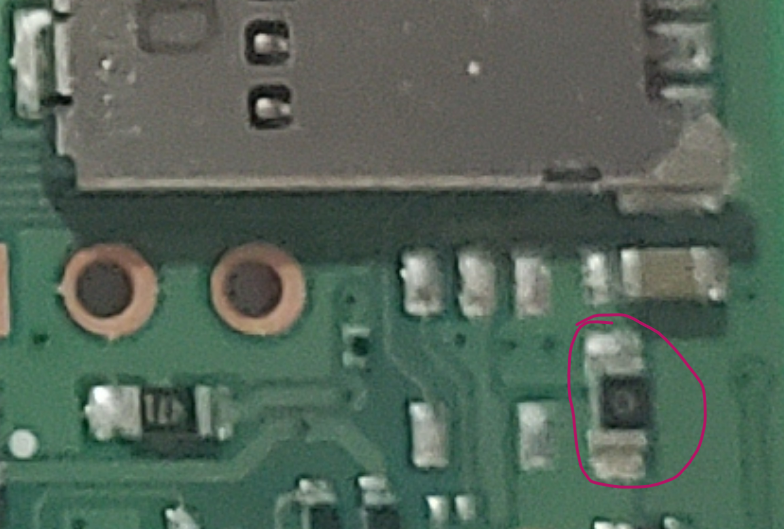
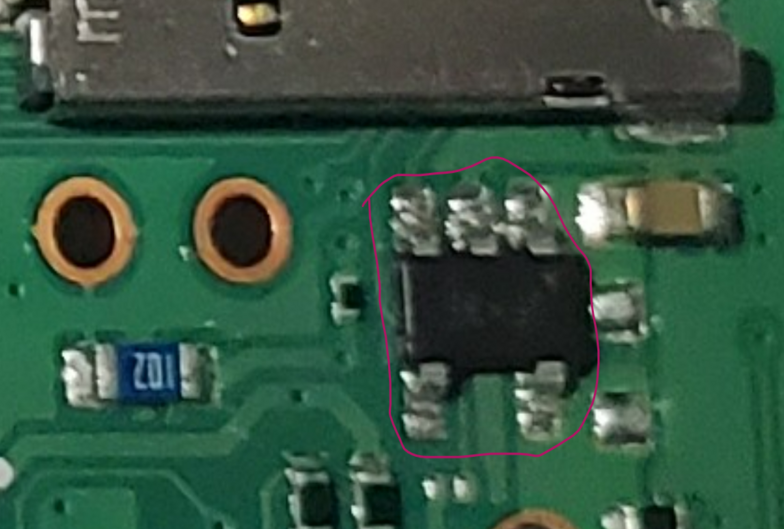

# Pi 4 Model B

Board-level repair reference for the Raspberry Pi 4 Model B.

Available in 1GB, 2GB, 3GB, 4GB, and 8GB RAM configurations. The PCB revision determines hardware differences that matter for repair (power regulation, USB-C fixes, VL805 EEPROM presence, SoC stepping).

## Revision Identification

If the board boots, the most reliable way to identify the revision is via software. See the [Board Identification guide](../../guides/board-identification.md).

For non-booting boards, the following physical attributes can help narrow down the revision:

| Attribute | Rev 1.1–1.4 | Rev 1.5 |
|-----------|-------------|---------|
| **PMIC** | MxL7704 (MaxLinear) | DA9090 (Dialog/Renesas) |

### 5-Pin Component Below MicroSD Slot

On the bottom of the board, near the microSD slot, there is a 5-pad footprint. On Rev 1.1/1.2 this footprint is unpopulated; on Rev 1.4+ the component is populated. This can help distinguish earlier revisions from later ones.

  <figure style="flex: 1; min-width: 200px; margin: 0;">
    
    <figcaption style="text-align: center; font-size: 0.8rem;">Rev 1.2 — footprint unpopulated</figcaption>
  </figure>
  <figure style="flex: 1; min-width: 200px; margin: 0;">
    
    <figcaption style="text-align: center; font-size: 0.8rem;">Rev 1.4 — component populated</figcaption>
  </figure>

## Revisions

| Revision | Key Changes  |
|----------|-------------|
| [Rev 1.5](rev-1.5/index.md) | BCM2711 C0 stepping, improved thermals, 1.8GHz  |
| [Rev 1.4](rev-1.4/index.md) | VL805 EEPROM removed  |
| [Rev 1.2](rev-1.2/index.md) | USB-C fix, power regulator upgrade for 8GB  |
| [Rev 1.1](rev-1.1/index.md) | Initial release (USB-C PD bug)  |

