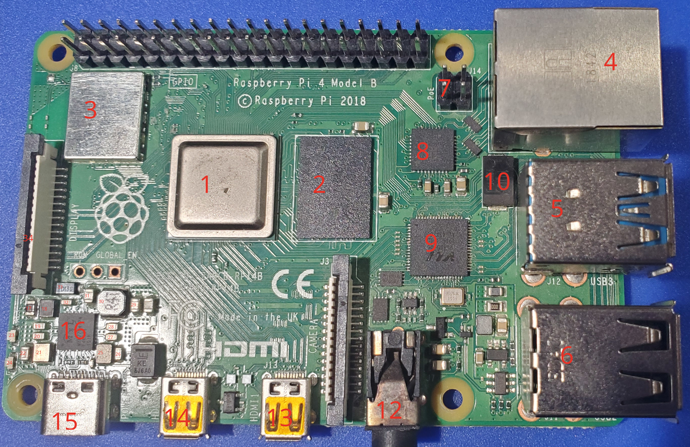
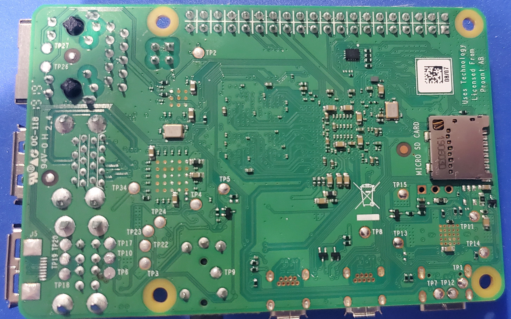

<!-- TODO: Check if applicable https://forums.raspberrypi.com/viewtopic.php?t=343096 -->

# Pi 4 B Rev 1.1 Components

## Top

<table>
  <tr>
    <th>ID</th>
    <th>Official Label</th>
    <th>Type</th>
    <th>Package</th>
    <th>Value</th>
    <th>Replacement(s)</th>
    <th>Source(s)</th>
    <th>Notes</th>
  </tr>
  <tr>
    <td>48</td>
    <td></td>
    <td>Resistor (Series)</td>
    <td></td>
    <td>33–34Ω</td>
    <td></td>
    <td>Self-Measured</td>
    <td>SD card CLK series resistor. Upper-left of SOC. Left pad measures ~0.8Ω to SD card slot CLK pin; right pad measures ~34Ω across component.</td>
  </tr>
</table>

## Bottom

<table>
  <tr>
    <th>ID</th>
    <th>Official Label</th>
    <th>Type</th>
    <th>Package</th>
    <th>Value</th>
    <th>Replacement(s)</th>
    <th>Source(s)</th>
    <th>Notes</th>
  </tr>
</table>
