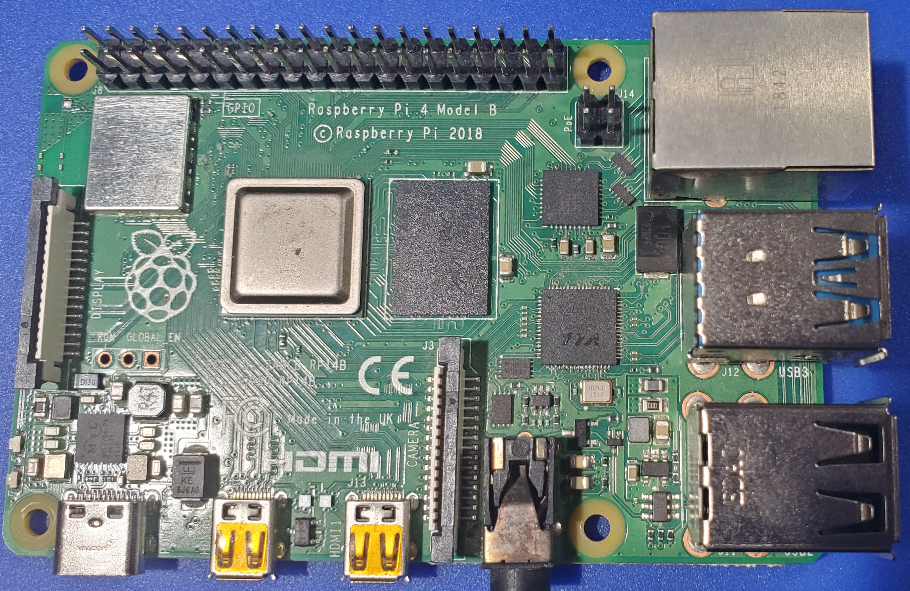
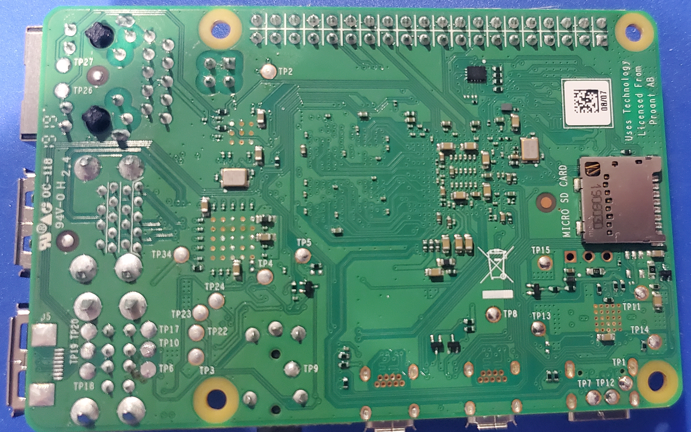

# Pi 4 Model B - Rev 1.1

Board-level repair reference for the Raspberry Pi 4 Model B, PCB revision 1.1.

  <figure style="flex: 1; min-width: 200px; margin: 0;">
    
    <figcaption style="text-align: center; font-size: 0.8rem;">Top</figcaption>
  </figure>
  <figure style="flex: 1; min-width: 200px; margin: 0;">
    
    <figcaption style="text-align: center; font-size: 0.8rem;">Bottom</figcaption>
  </figure>

## Identification

- **Revision codes:** a03111 (1GB), b03111 (2GB), c03111 (4GB)
- **Release:** June 2019 (initial launch)
- **Known issues:** USB-C connector missing CC resistor — some USB-C PD chargers do not recognize the board

## Sections
- [Test Points](test-points.md) - Test point map and expected readings

---

*Want to help fill in this page? See [Contributing](/contributing/).*
