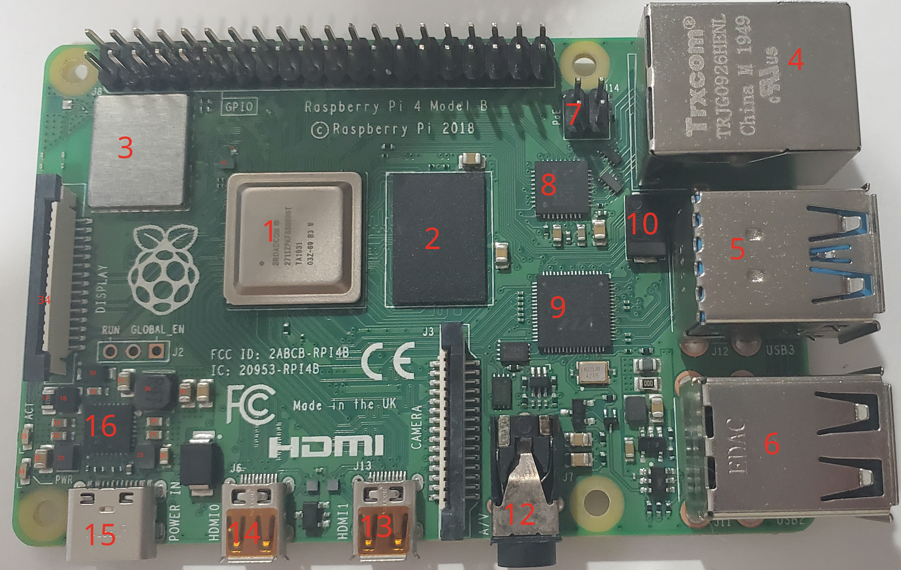
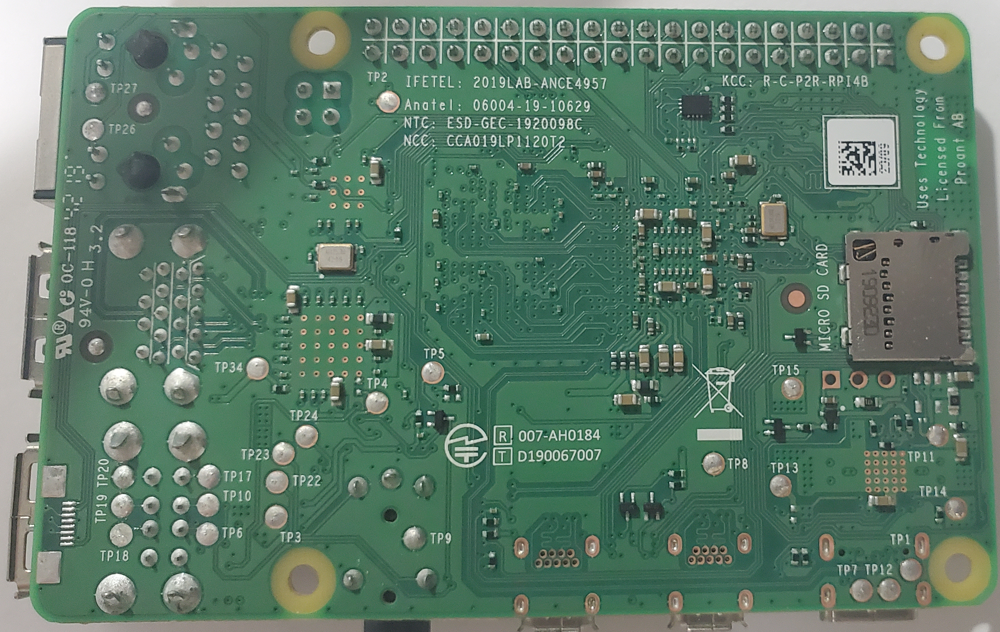

<!-- TODO: Fill in component details from https://forums.raspberrypi.com/viewtopic.php?t=400091 -->
<!-- TODO: Check if applicable https://forums.raspberrypi.com/viewtopic.php?t=343096 -->

# Pi 4 B Rev 1.2 Components

## Top

<table>
  <tr>
    <th>ID</th>
    <th>Official Label</th>
    <th>Type</th>
    <th>Package</th>
    <th>Value</th>
    <th>Replacement(s)</th>
    <th>Source(s)</th>
    <th>Notes</th>
  </tr>
</table>

## Bottom

<table>
  <tr>
    <th>ID</th>
    <th>Official Label</th>
    <th>Type</th>
    <th>Package</th>
    <th>Value</th>
    <th>Replacement(s)</th>
    <th>Source(s)</th>
    <th>Notes</th>
  </tr>
</table>
