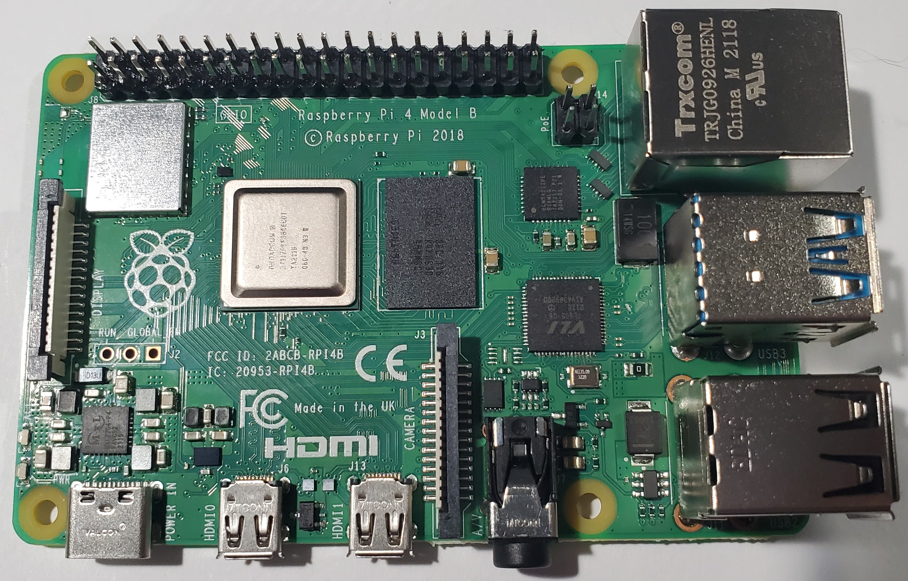
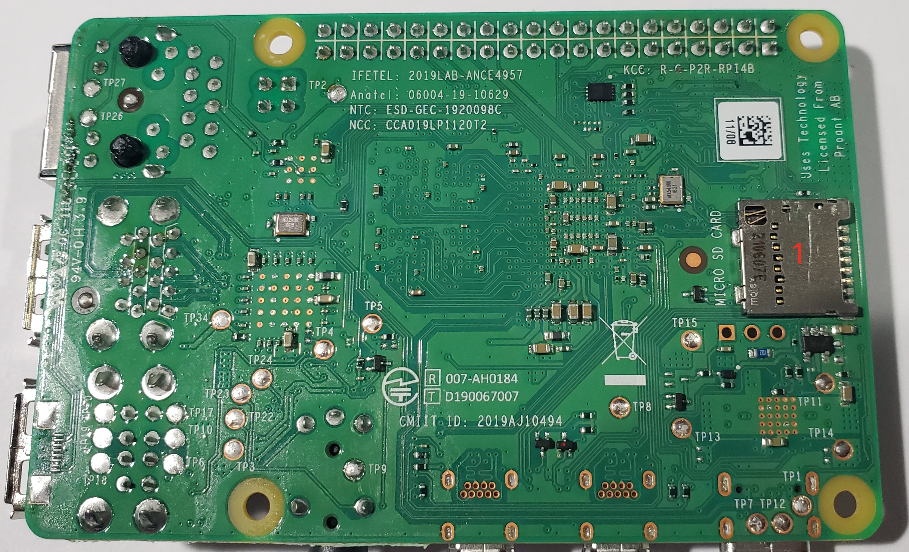

<!-- TODO: Check if applicable https://forums.raspberrypi.com/viewtopic.php?t=343096 -->

# Pi 4 B Rev 1.4 Components

## Top

<table>
  <tr>
    <th>ID</th>
    <th>Official Label</th>
    <th>Type</th>
    <th>Package</th>
    <th>Value</th>
    <th>Replacement(s)</th>
    <th>Source(s)</th>
    <th>Notes</th>
  </tr>
  <tr>
    <td>11</td>
    <td></td>
    <td>TVS Diode</td>
    <td>SMB</td>
    <td>5VWM 9.2VC, Unidirectional, 5W cont. 600W pk</td>
    <td>
      <a href="https://www.digikey.com/en/products/detail/littelfuse-inc/smbj5-0a/285950">DigiKey</a>
    </td>
    <td>
      <a href="https://forums.raspberrypi.com/viewtopic.php?t=400087#p2385305">Raspberry Pi Forum</a>
    </td>
    <td>Littelfuse SMBJ5.0A</td>
  </tr>

 
  <tr>
    <td>48</td>
    <td></td>
    <td>Resistor (Series)</td>
    <td></td>
    <td>33–34Ω</td>
    <td></td>
    <td>Self-Measured</td>
    <td>SD card CLK series resistor. Upper-left of SOC. Left pad measures ~0.8Ω to SD card slot CLK pin; right pad measures ~34Ω across component.</td>
  </tr>
  <tr>
    <td>61</td>
    <td></td>
    <td>Capacitor</td>
    <td></td>
    <td>44.2µF</td>
    <td></td>
    <td>Self-Measured using LCR Meter</td>
    <td></td>
  </tr>
  <tr>
    <td>84</td>
    <td></td>
    <td>IC Power Switch P-Channel 1:1</td>
    <td>SOT-26</td>
    <td></td>
    <td>
      <a href="https://www.digikey.com/en/products/detail/diodes-incorporated/ap2552w6-7/3882052">DigiKey</a>
    </td>
    <td>
      <a href="https://forums.raspberrypi.com/viewtopic.php?t=400087#p2385305">Raspberry Pi Forum</a>
    </td>
    <td>Diodes Incorporated AP2552W6-7</td>
  </tr>
</table>

## Bottom

<table>
  <tr>
    <th>ID</th>
    <th>Official Label</th>
    <th>Type</th>
    <th>Package</th>
    <th>Value</th>
    <th>Replacement(s)</th>
    <th>Source(s)</th>
    <th>Notes</th>
  </tr>

  <tr>
    <td>29</td>
    <td></td>
    <td>Mosfet</td>
    <td>SOT-523</td>
    <td></td>
    <td>
      <a href="https://www.digikey.co.uk/en/products/detail/diodes-incorporated/DMG1012T-7/2174582">DigiKey</a>
    </td>
    <td>
      <a href="https://forums.raspberrypi.com/viewtopic.php?t=400203#p2385834">Raspberry Pi Forum</a>
    </td>
    <td>DMG1012T</td>
  </tr>
</table>
