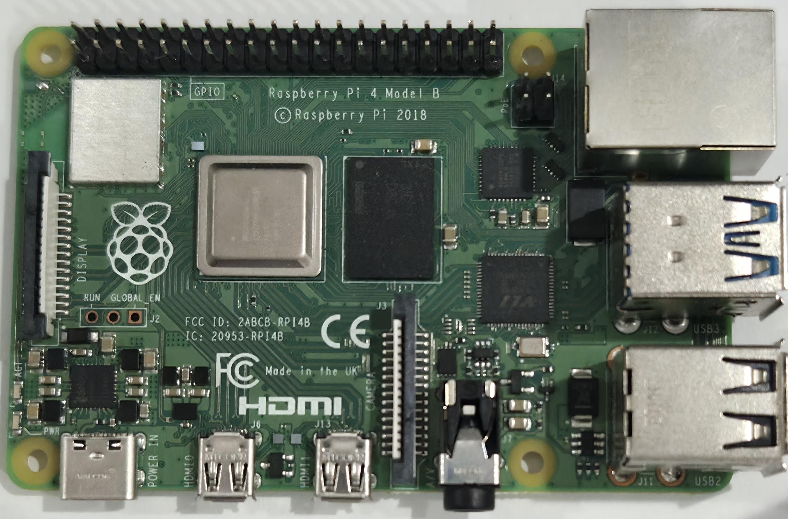

# Pi 4 B Rev 1.5 Components

## Top

## Bottom

<table>
  <tr>
    <th>ID</th>
    <th>Official Label</th>
    <th>Type</th>
    <th>Package</th>
    <th>Value</th>
    <th>Replacement(s)</th>
    <th>Source(s)</th>
    <th>Notes</th>
  </tr>
  <tr>
    <td>1</td>
    <td></td>
    <td></td>
    <td></td>
    <td></td>
    <td></td>
    <td></td>
    <td>SD Card Slot</td>
  </tr>
  <tr>
    <td>2</td>
    <td></td>
    <td></td>
    <td>TSOT-23-5</td>
    <td></td>
    <td>
        <a href="https://www.digikey.com/en/products/detail/richtek-usa-inc/RT9742GGJ5/5880519">DigiKey</a>
    </td>
    <td>
        <a href="https://forums.raspberrypi.com/viewtopic.php?t=326950">Raspberry PI Forum</a>
    </td>
    <td></td>
  </tr>
  <tr>
    <td>3</td>
    <td></td>
    <td></td>
    <td></td>
    <td></td>
    <td></td>
    <td></td>
    <td></td>
  </tr>
  <tr>
    <td>4</td>
    <td></td>
    <td></td>
    <td></td>
    <td></td>
    <td></td>
    <td></td>
    <td></td>
  </tr>
</table>