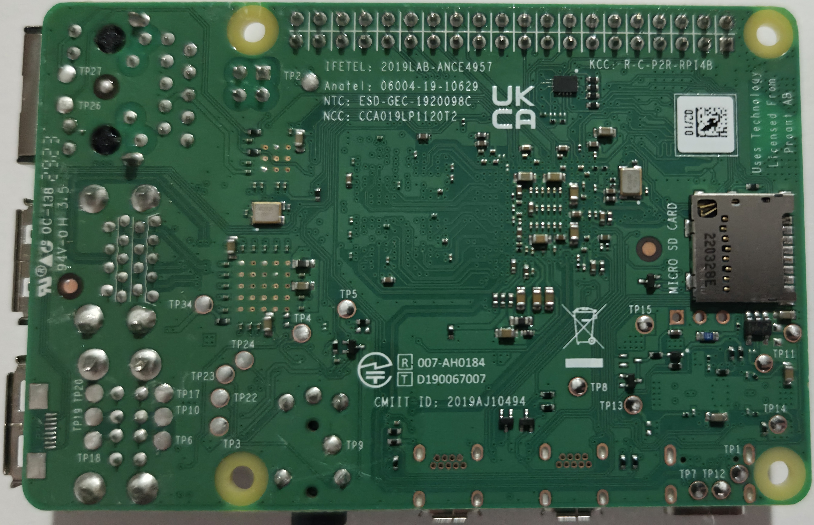

# Pi 4 Model B - Rev 1.5

Board-level repair reference for the Raspberry Pi 4 Model B, PCB revision 1.5.

  <figure style="flex: 1; min-width: 200px; margin: 0;">
    
    <figcaption style="text-align: center; font-size: 0.8rem;">Top</figcaption>
  </figure>
  <figure style="flex: 1; min-width: 200px; margin: 0;">
    
    <figcaption style="text-align: center; font-size: 0.8rem;">Bottom</figcaption>
  </figure>

## Identification

- **Revision codes:** b03115 (2GB), c03115 (4GB), d03115 (8GB)
- **Release:** Mid-2021 onwards
- **Key changes from Rev 1.4:** BCM2711 C0 stepping, default clock raised to 1.8GHz, improved thermal performance

## Sections
- [Test Points](test-points.md) - Test point map and expected readings

---

*Want to help fill in this page? See [Contributing](/contributing/).*
