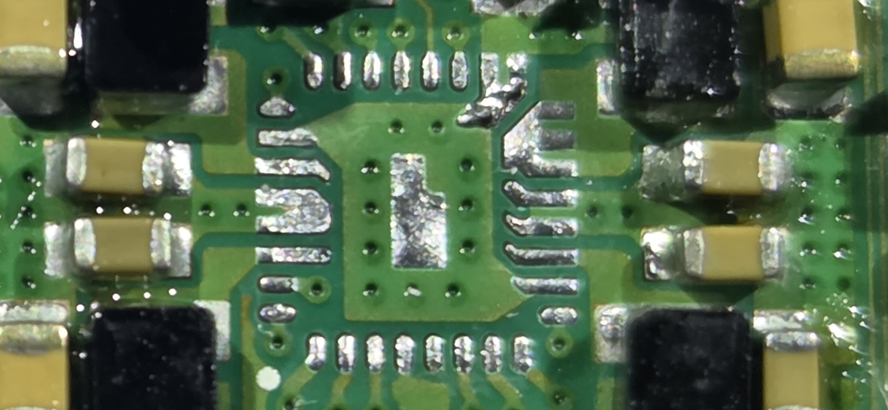
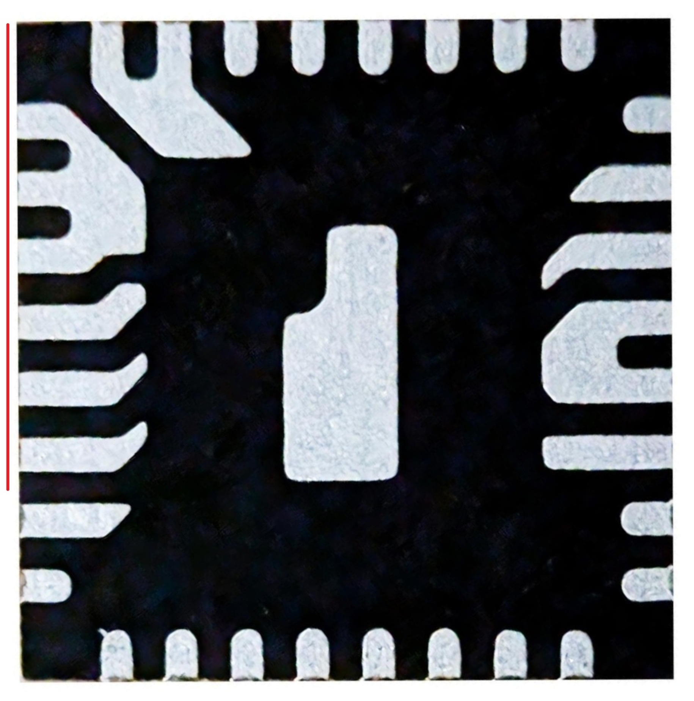

# DA9090 (Dialog / Renesas)

The DA9090 is the PMIC used on Pi 4 Model B revision 1.5.

## Replacement Sourcing

The DA9090 can be difficult to find in stock but is available from the following distributors:

- [The Pi Hut (UK)](https://thepihut.com/products/da9090-pmic-5-pack)
- [Core Electronics (AU)](https://core-electronics.com.au/raspberry-pi-4-da9090-power-management-ic-5-pack.html)

## Pad Reference

The left image shows the pads on the board with the DA9090 removed. The right image
shows the underside of the chip itself. The red line on the chip image denotes the axis
it was flipped on — to mentally map the chip pads to the board pads, flip the chip image along that axis.

| Board Pads (chip removed) | Chip Pads (red line = flip axis) |
|:---|:---|
|  |  |

<!-- TODO: Add annotated pad reference image -->

## Pin Reference

Measure **Resistance to Ground** with the board unpowered using GPIO PIN 6 (GND) and **Voltage** with the board powered on at idle.

| Pin | Function | Description | Resistance to Gnd (Ω) | Voltage (V) |
||-----|----------|-------------|----------------------:|------------:|
|| 1   | VDDIO    | | OL | 3.3 |
|| 2   | SDA      | | OL | 3.3 |
|| 3   | SCL      | | OL | 3.3 |
|| 4   | SEQ_EN   | | 0.3 | 0 |
|| 5   | PG1      | | OL | 0.19 |
|| 6   | GLOBAL_EN | | OL | 5 |
|| 7   | VIN_LDO  | | OL | 5 |
|| 8   | LDO_OUT  | | OL | 0 |
|| 9   | VOUT2    | | OL | 1.8 |
|| 10  | PGND2    | | 0.2 | 0 |
|| 11  | LX2      | | OL | 1.8 |
|| 12  | VIN2     | | OL | 5 |
|| 13  | VIN4     | | OL | 5 |
|| 14  | LX4_1    | | 55 | 1 |
|| 15  | LX4_2    | | 55 | 1 |
|| 16  | LX4_3    | | 55 | 1 |
|| 17  | PGND4_1  | | 0.2 | 0 |
|| 18  | PGND4_2  | | 0.2 | 0 |
|| 19  | VOUT4    | | 154 | 1 |
|| 20  | PG2      | | OL | 3.3 |
|| 21  | AN1      | | OL | 0.4 |
|| 22  | AN2      | | OL | 0 |
|| 23  | AGND     | | 2 | 0 |
|| 24  | 5V_SYS   | | OL | 5 |
|| 25  | VOUT1    | | OL | 3.3 |
|| 26  | PGND1    | | 0.2 | 0 |
|| 27  | LX1      | | OL | 3.3 |
|| 28  | VIN1     | | OL | 5 |
|| 29  | VIN3     | | OL | 5 |
|| 30  | LX3      | | OL | 1.1 |
|| 31  | 5V_SYS_2 | | OL | 5 |
|| 32  | VOUT3    | | 200 | 1.1 |
|| 33  | PAD_GND   | | — | 0 |

## Area Breakout

<!-- TODO: Add indexed component map and table similar to Pi 5 PMIC breakdown -->

---

*Want to help fill in this page? See [Contributing](/contributing/).*
