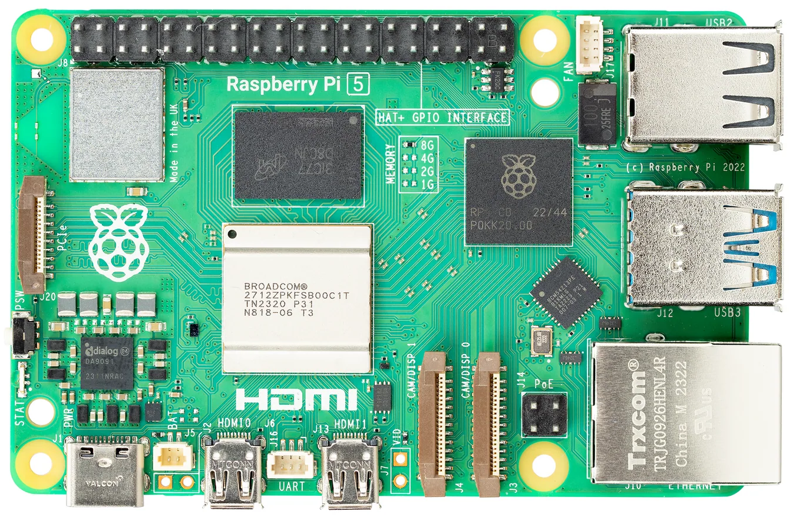
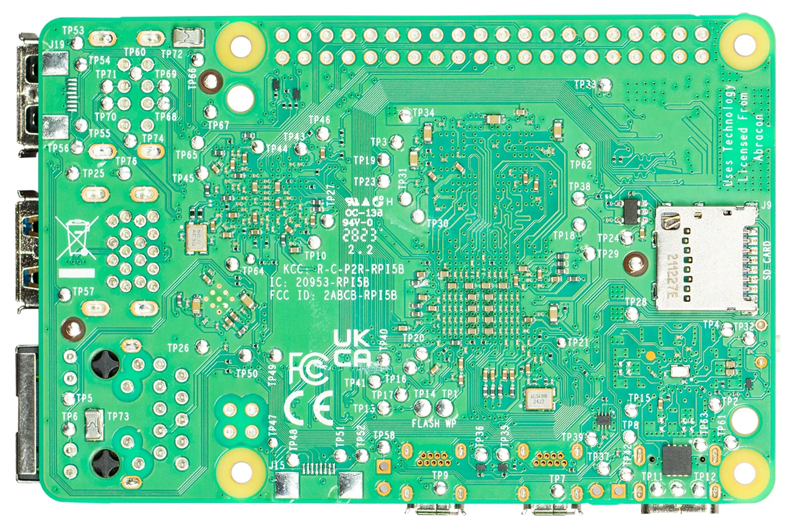

# Pi 5

Repair reference data for Raspberry Pi 5 boards.

The Pi 5 does not use a "Model A" / "Model B" designation — there is a single board design with multiple RAM configurations (1GB, 2GB, 4GB, 8GB, 16GB). Revisions reflect PCB-level hardware changes.

## Board Photos

  <figure style="flex: 1; min-width: 200px; margin: 0;">
    
    <figcaption style="text-align: center; font-size: 0.8rem;">Top</figcaption>
  </figure>
  <figure style="flex: 1; min-width: 200px; margin: 0;">
    
    <figcaption style="text-align: center; font-size: 0.8rem;">Bottom</figcaption>
  </figure>

## Revisions

| Revision | Key Changes | Status |
|----------|-------------|--------|
| [Rev 1.1](rev-1.1/index.md) | NUMA support, performance tweaks | TODO |
| [Rev 1.0](rev-1.0/index.md) | Initial release | TODO |
