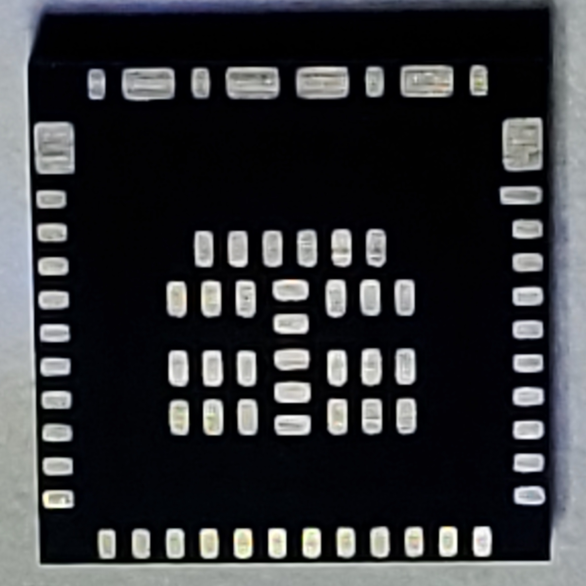
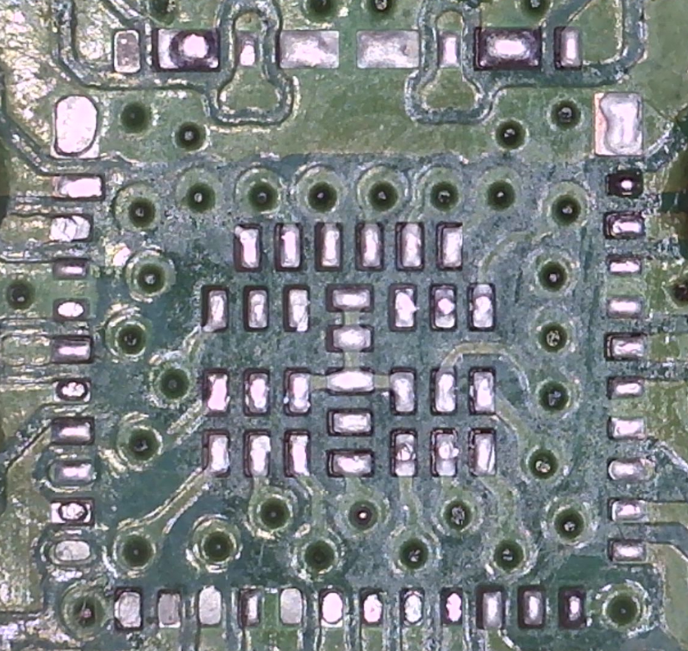
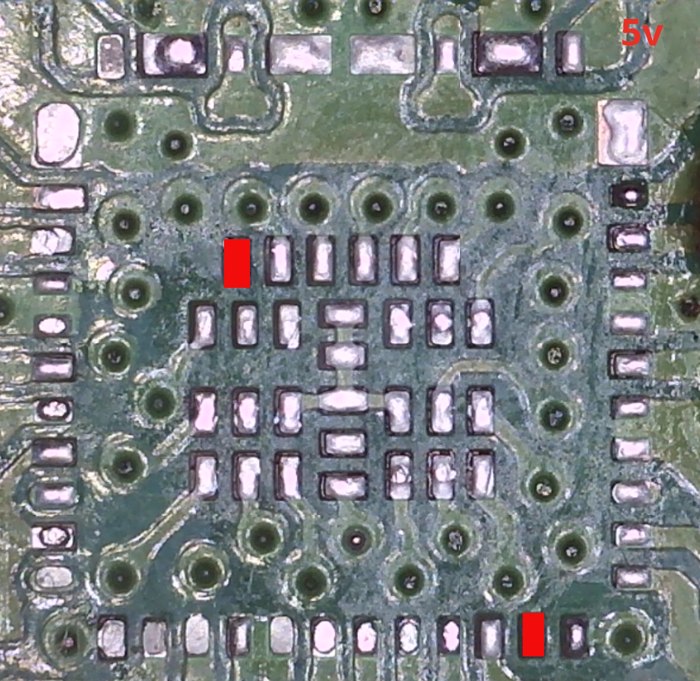
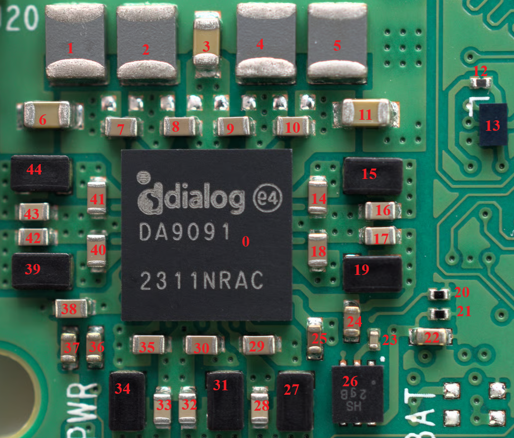

# Power Management IC

Very few resources seem to exist publicly documenting the PMIC and nearby components. 
This is a breakdown of the PMIC area of the Pi 5 board. It represents the aggregation 
of my own testing and information available on the Internet.

## Replacement Sourcing
The primary power management chip on the PI 5 is a DA9091 which seems to have been
purpose built for the Raspberry PI and as a result is not a general purpose
component that you can source online.

That said, it does appear that [PI Hut](https://thepihut.com/products/da9091-pmic-5-pack)
 in the UK sells these.

## Pad Reference
These were taken from a non working board, so needs verification. Measurements
were taken on the board so you have to imagine the chip image was flipped 180 degrees
on either of its vertical axis.

Ground was established without power and testing continuity.

5.3v was measured with the board plugged in and nothing else.This initial mapping was
focused on what was connected directly to the USB C input. Its not an exhaustive list
of 5v pads, but rather those pads which are getting 5v directly from the input rail. 
These in theory represent the input power to the PMIC itself. 

  <figure style="flex: 1; min-width: 150px; margin: 0; width: 150px">
    
     <figcaption style="text-align: center; font-size: 0.8rem;">Pad Photo</figcaption>
  </figure>
  <figure style="flex: 1; min-width: 150px; margin: 0; width: 150px">
    
     <figcaption style="text-align: center; font-size: 0.8rem;">Aannotated Pad Photo</figcaption>
  </figure>

 
 

The following image was taken with the DA 9091 chip physically
removed from the board showing the pad layout that is on 
the underside of the chip. Measurements were taken with the USB-C
plugged in and the PMIC removed to try and highlight where 5v
enters the PMIC

  <figure style="flex: 1; min-width: 150px; margin: 0; width: 150px">
    
     <figcaption style="text-align: center; font-size: 0.8rem;">Board Photo</figcaption>
  </figure>
  <figure style="flex: 1; min-width: 150px; margin: 0; width: 150px">
    
     <figcaption style="text-align: center; font-size: 0.8rem;">Annotated Board Photo</figcaption>
  </figure>

## Area Breakout

<table>
  <tr>
    <th>#</th><th>Type</th><th>Package</th><th>Value</th><th>Power Rail</th><th>Links</th><th>Notes</th>
  </tr>
  <tr>
    <td>0</td>
    <td></td>
    <td>QFN</td>
    <td></td>
    <td>multiple</td>
    <td>
      <ul>
        <li><a href="https://thepihut.com/products/da9091-pmic-5-pack">Pi Hut Item</a></li>
      </ul>
    </td>
    <td>This is the PMIC itself. As of 2026-05-29 Pi Hut seems to be the only place to source one.
       
      Can be either Renesas or Dialog
    </td>
  </tr>
  <tr><td>1</td>
    <td>Inductor</td>
    <td></td>
    <td></td>
    <td></td>
    <td>
      <a href="https://magazine.raspberrypi.com/articles/raspberry-pi-5">Inductor Indentification</a>
    </td>
    <td></td>
  </tr>
  <tr><td>2</td>
    <td>Inductor</td>
    <td></td>
    <td></td>
    <td></td>
    <td>
      <a href="https://magazine.raspberrypi.com/articles/raspberry-pi-5">Inductor Indentification</a>
    </td>
    <td></td>
  </tr>
  <tr>
    <td>3</td>
    <td>Capacitor</td>
    <td></td>
    <td></td>
    <td>0.8v</td>
    <td>
      <a href="https://forums.raspberrypi.com/viewtopic.php?t=374141&start=25#p2240900">Voltage Source</a>
    </td>
    <td></td>
  </tr>
  <tr><td>4</td>
    <td>Inductor</td>
    <td></td>
    <td></td>
    <td></td>
    <td>
      <a href="https://magazine.raspberrypi.com/articles/raspberry-pi-5">Inductor Indentification</a>
    </td>
    <td></td>
  </tr>
  <tr><td>5</td>
      <td>Inductor</td>
    <td></td>
    <td></td>
    <td></td>
    <td>
      <a href="https://magazine.raspberrypi.com/articles/raspberry-pi-5">Inductor Indentification</a>
    </td>
    <td></td>
  </tr>
  <tr><td>6</td></tr>
  <tr><td>7</td>
    <td>Capacitor</td>
    <td>0402</td>
    <td></td>
    <td>5v</td>
    <td></td>
    <td>self-measured</td>
  </tr>
  <tr>
    <td>8</td>
    <td>Capacitor</td>
    <td>0402</td>
    <td>22µF</td>
    <td>5v</td>
    <td>
      <ul>
        <li><a href="https://www.digikey.com/short/d4jwf15w">DigiKey</a></li>
      </ul>
    </td>
    <td>Self measured</td>
  </tr>
  <tr><td>9</td>
    <td>Capacitor</td>
    <td>0402</td>
    <td></td>
    <td>5v</td>
    <td></td>
    <td>self-measured</td>
  </tr>
  <tr><td>10</td>
    <td>Capacitor</td>
    <td>0402</td>
    <td></td>
    <td>5v</td>
    <td></td>
    <td>self-measured</td>
  </tr>
  <tr><td>11</td></tr>
  <tr><td>12</td></tr>
  <tr><td>13</td></tr>
  <tr><td>14</td>
    <td>Capacitor</td>
    <td>0402</td>
    <td></td>
    <td>5v</td>
    <td></td>
    <td>self-measured</td>
  </tr>
  <tr><td>15</td>
    <td>Inductor</td>
    <td></td>
    <td></td>
    <td></td>
    <td>
      <a href="https://magazine.raspberrypi.com/articles/raspberry-pi-5">Inductor Indentification</a>
    </td>
    <td></td>
  </tr>
  <tr><td>16</td>
    <td>Capacitor</td>
    <td></td>
    <td></td>
    <td>0.8v</td>
    <td>
      <a href="https://forums.raspberrypi.com/viewtopic.php?t=374141&start=25#p2240900">Voltage Source</a>
    </td>
    <td></td>
  </tr>
  <tr><td>17</td>
    <td>Capacitor</td>
    <td></td>
    <td></td>
    <td>1.1v</td>
    <td>
      <a href="https://forums.raspberrypi.com/viewtopic.php?t=374141&start=25#p2240900">Voltage Source</a>
    </td>
    <td></td>
  </tr>
  <tr><td>18</td>
    <td>Capacitor</td>
    <td>0402</td>
    <td></td>
    <td>5v</td>
    <td></td>
    <td>self-measured</td>
  </tr>
  <tr><td>19</td>
    <td>Inductor</td>
    <td></td>
    <td></td>
    <td></td>
    <td>
      <a href="https://magazine.raspberrypi.com/articles/raspberry-pi-5">Inductor Indentification</a>
    </td>
    <td></td>
  </tr>
  <tr><td>20</td></tr>
  <tr><td>21</td></tr>
  <tr><td>22</td></tr>
  <tr><td>23</td>
    <td>Capacitor</td>
    <td></td>
    <td></td>
    <td>5v</td>
    <td></td>
    <td>self-measured</td>
  </tr>
  <tr><td>24</td></tr>
  <tr><td>25</td></tr>
  <tr><td>26</td></tr>
  <tr><td>27</td>
    <td>Inductor</td>
    <td></td>
    <td></td>
    <td></td>
    <td>
      <a href="https://magazine.raspberrypi.com/articles/raspberry-pi-5">Inductor Indentification</a>
    </td>
    <td></td>
  </tr>
  <tr><td>28</td>
    <td>Capacitor</td>
    <td></td>
    <td></td>
    <td>0.6v</td>
    <td>
      <a href="https://forums.raspberrypi.com/viewtopic.php?t=374141&start=25#p2240900">Voltage Source</a>
    </td>
    <td></td>
  </tr>
  <tr><td>29</td>
    <td>Capacitor</td>
    <td>0402</td>
    <td></td>
    <td>5v</td>
    <td></td>
    <td>self-measured</td>
  </tr>
  <tr><td>30</td>
    <td>Capacitor</td>
    <td>0402</td>
    <td></td>
    <td>5v</td>
    <td></td>
    <td>self-measured</td>
  </tr>
  <tr><td>31</td>
    <td>Inductor</td>
    <td></td>
    <td></td>
    <td></td>
    <td>
      <a href="https://magazine.raspberrypi.com/articles/raspberry-pi-5">Inductor Indentification</a>
    </td>
    <td></td>
  </tr>
  <tr><td>32</td>
    <td>Capacitor</td>
    <td></td>
    <td></td>
    <td>1.1v</td>
    <td>
      <a href="https://forums.raspberrypi.com/viewtopic.php?t=374141&start=25#p2240900">Voltage Source</a>
    </td>
    <td></td>
  </tr>
  <tr><td>33</td>
    <td>Capacitor</td>
    <td></td>
    <td></td>
    <td>1.8v</td>
    <td>
      <a href="https://forums.raspberrypi.com/viewtopic.php?t=374141&start=25#p2240900">Voltage Source</a>
    </td>
    <td></td>
  </tr>
  <tr><td>34</td>
    <td>Inductor</td>
    <td></td>
    <td></td>
    <td></td>
    <td>
      <a href="https://magazine.raspberrypi.com/articles/raspberry-pi-5">Inductor Indentification</a>
    </td>
    <td></td>
  </tr>
  <tr><td>35</td>
    <td>Capacitor</td>
    <td>0402</td>
    <td></td>
    <td>5v</td>
    <td></td>
    <td>self-measured</td>
  </tr>
  <tr><td>36</td>
    <td>Capacitor</td>
    <td>0402</td>
    <td>4.7µF</td>
    <td></td>
    <td>
      <a href="https://forums.raspberrypi.com/viewtopic.php?p=2284048#p2284119">Value Source</a>
    </td>
    <td>0402 4u7 6V3 X5R</td>
  </tr>
  <tr><td>37</td>
    <td>Capacitor</td>
    <td>0402</td>
    <td>4.7µF</td>
    <td></td>
    <td>
      <a href="https://forums.raspberrypi.com/viewtopic.php?p=2284048#p2284119">Value Source</a>
    </td>
    <td>0402 4u7 6V3 X5R</td>
  </tr>
  <tr><td>38</td>
    <td>Capacitor</td>
    <td>0402</td>
    <td></td>
    <td>5v</td>
    <td></td>
    <td>self-measured</td>
  </tr>
  <tr><td>39</td>
    <td>Inductor</td>
    <td></td>
    <td></td>
    <td></td>
    <td>
      <a href="https://magazine.raspberrypi.com/articles/raspberry-pi-5">Inductor Indentification</a>
    </td>
    <td></td>
  </tr>
  <tr><td>40</td>
    <td>Capacitor</td>
    <td>0402</td>
    <td></td>
    <td>5v</td>
    <td></td>
    <td>self-measured</td>
  </tr>
  <tr><td>41</td>
    <td>Capacitor</td>
    <td>0402</td>
    <td></td>
    <td>5v</td>
    <td></td>
    <td>self-measured</td>
  </tr>
  <tr><td>42</td>
    <td>Capacitor</td>
    <td></td>
    <td></td>
    <td>3.3v</td>
    <td>
      <a href="https://forums.raspberrypi.com/viewtopic.php?t=374141&start=25#p2240900">Voltage Source</a>
    </td>
    <td></td>
  </tr>
  <tr><td>43</td>
    <td>Capacitor</td>
    <td></td>
    <td></td>
    <td>3.7v</td>
    <td>
      <a href="https://forums.raspberrypi.com/viewtopic.php?t=374141&start=25#p2240900">Voltage Source</a>
    </td>
    <td></td>
  </tr>
  <tr><td>44</td>
    <td>Inductor</td>
    <td></td>
    <td></td>
    <td></td>
    <td>
      <a href="https://magazine.raspberrypi.com/articles/raspberry-pi-5">Inductor Indentification</a>
    </td>
    <td></td>
  </tr>
</table>