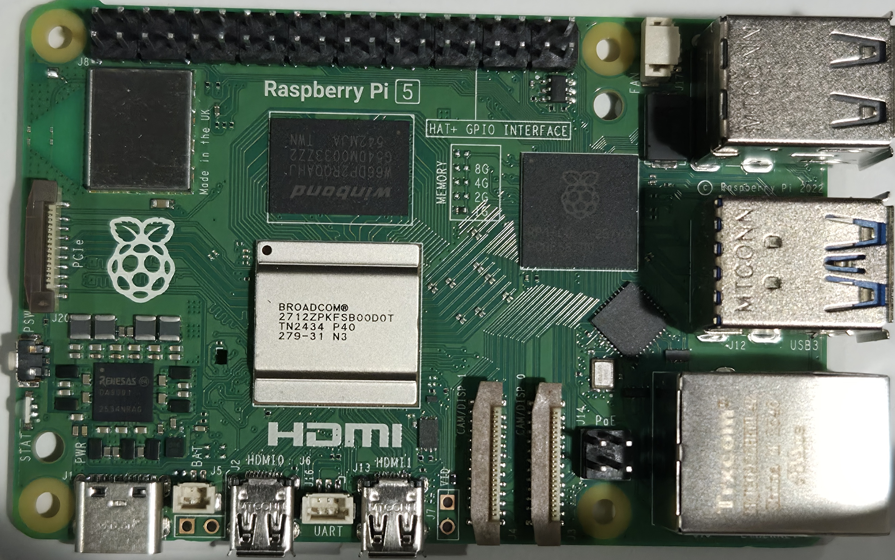
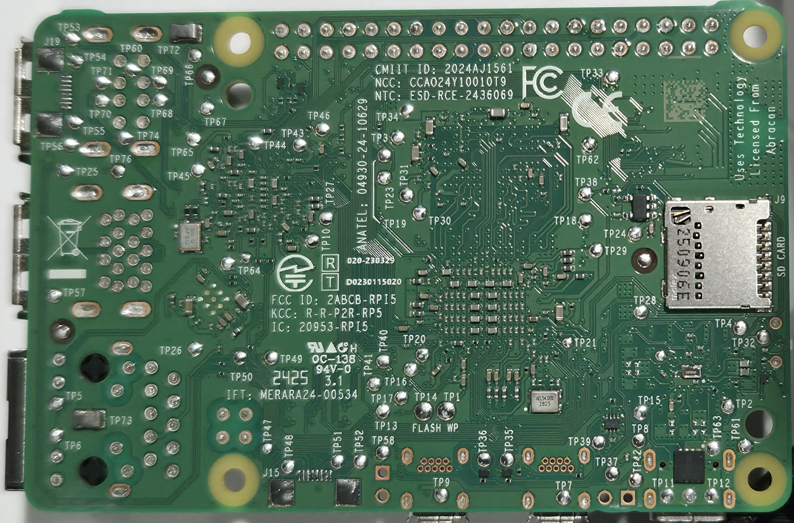

# Pi 5 - Rev 1.1

Board-level repair reference for the Raspberry Pi 5, PCB revision 1.1.

Board-level repair reference for the Raspberry Pi 3 Model B, PCB revision 1.2.

  <figure style="flex: 1; min-width: 200px; margin: 0;">
    
    <figcaption style="text-align: center; font-size: 0.8rem;">Top</figcaption>
  </figure>
  <figure style="flex: 1; min-width: 200px; margin: 0;">
    
    <figcaption style="text-align: center; font-size: 0.8rem;">Bottom</figcaption>
  </figure>

## Identification

- **Revision codes:** <!-- TODO: Confirm revision codes for Rev 1.1 -->
- **Release:** <!-- TODO: Confirm release date -->
- **Key changes from Rev 1.0:** NUMA support, performance improvements

## Sections
- [Test Points](test-points.md) - Test point map and expected readings
- [Voltage Reference](voltage_reference.md) - Voltage maps for bare board

---

*Want to help fill in this page? See [Contributing](/contributing/).*
