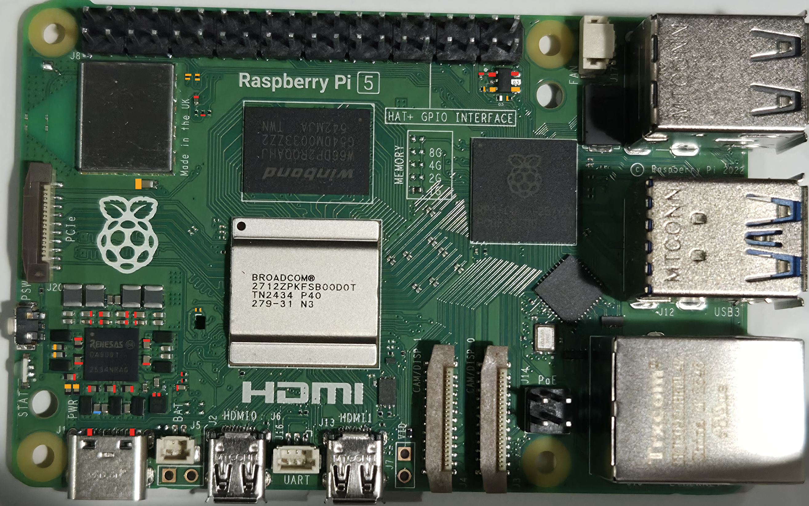

# Pi 5 Rev 1.1 - Voltage Reference

## Power Only

The following readings have been taken from a PI 3 B+ with nothing
attached except power. No Display, no SD Card, nothing...

### Top

### Bottom

### Legend
<table>
  <tr>
    <td width="10%">
       Ground  
       5v  
       3.3v  
       1.8v  

      
    </td>
    <td></td>
    <td></td>
  </tr>
</table>
