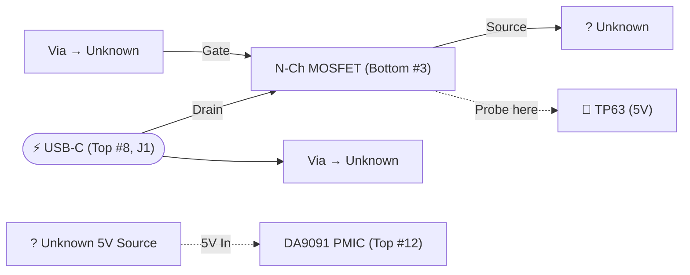

# Pi 5 - 5V Power Flow

!!! warning "Disclaimer"
    This page was produced through reverse engineering by a completely untrained
    hobbyist with a multimeter and more curiosity than qualifications. It is not
    based on official schematics, manufacturer documentation, or any formal
    electronics education. Treat everything here as "best guess" — it may be
    wrong, incomplete, or misleading.

This diagram shows how 5V power travels through the board from the USB-C
input.

Component references (e.g. "Top #8") refer to the numbered component lists
on the [Pi 5 Components](../components.md) page — "Top" or "Bottom" indicates
which side of the board, and the number matches the ID in that table.

## Power Flow

## MOSFET Pinout — Bottom #3 (DMG7430LFG-7)

<table style="border-collapse: collapse; text-align: center; font-family: monospace;">
  <tr>
    <td style="border: none; padding: 8px; vertical-align: middle;" rowspan="3">5V Out ➡</td>
    <td style="border: 1px solid #666; padding: 8px; background: #d4edda; color: #1a1a1a;">Pin 1 (Source)</td>
    <td style="padding: 0 20px;" rowspan="4"></td>
    <td style="border: 1px solid #666; padding: 8px; background: #fff3cd; color: #1a1a1a;">Pin 8 (Drain)</td>
    <td style="border: none; padding: 8px; vertical-align: middle;" rowspan="4">⬅ USB-C (5V In)</td>
  </tr>
  <tr>
    <td style="border: 1px solid #666; padding: 8px; background: #d4edda; color: #1a1a1a;">Pin 2 (Source)</td>
    <td style="border: 1px solid #666; padding: 8px; background: #fff3cd; color: #1a1a1a;">Pin 7 (Drain)</td>
  </tr>
  <tr>
    <td style="border: 1px solid #666; padding: 8px; background: #d4edda; color: #1a1a1a;">Pin 3 (Source)</td>
    <td style="border: 1px solid #666; padding: 8px; background: #fff3cd; color: #1a1a1a;">Pin 6 (Drain)</td>
  </tr>
  <tr>
    <td style="border: none; padding: 8px;">⬅ Via (Unknown) — 9.72V</td>
    <td style="border: 1px solid #666; padding: 8px; background: #cce5ff; color: #1a1a1a;">Pin 4 (Gate)</td>
    <td style="border: 1px solid #666; padding: 8px; background: #fff3cd; color: #1a1a1a;">Pin 5 (Drain)</td>
  </tr>
</table>

## 5V Test Points

See the full [Test Points (Rev 1.1)](../rev-1.1/test-points.md) page for voltage readings.
