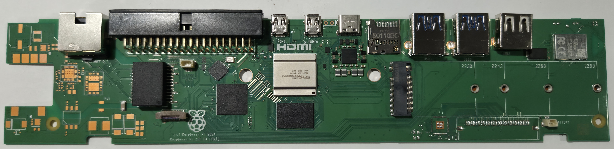

# Pi 500

Repair reference data for Raspberry Pi 500 boards.

The Pi 500 is a keyboard-integrated computer based on the BCM2712 SoC (same as Pi 5). It does not use a "Model A" / "Model B" designation — there is a single board design with an 8GB RAM configuration. Revisions reflect PCB-level hardware changes.

## Board Images

### Top

### Bottom

## Revisions

| Revision | Key Changes | Status |
|----------|-------------|--------|
| [Rev 1.0](rev-1.0/index.md) | Initial release | TODO |
