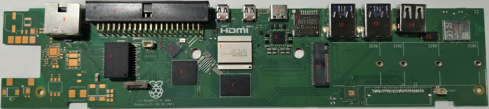
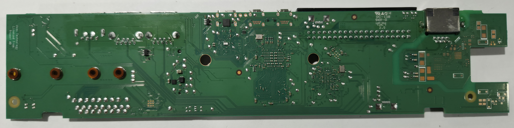

# Pi 500 Rev 1.0 - Components

## Top

<table>
  <tr>
    <th>ID</th>
    <th>Official Label</th>
    <th>Type</th>
    <th>Package</th>
    <th>Value</th>
    <th>Replacement(s)</th>
    <th>Source(s)</th>
    <th>Notes</th>
  </tr>
  <tr>
    <td>11</td>
    <td></td>
    <td>Micro SD Card Slot</td>
    <td></td>
    <td></td>
    <td>
      <a href="https://www.digikey.com/en/products/detail/molex/5033981892/4555393">DigiKey</a>
    </td>
    <td></td>
    <td>Likely Molex 5033981892 — not 100% confirmed</td>
  </tr>
  <tr>
    <td>18</td>
    <td></td>
    <td>Keyboard Ribbon Cable Connector</td>
    <td></td>
    <td></td>
    <td>
      <a href="https://www.amazon.com/dp/B0CQZ1BZY1">Amazon</a>
    </td>
    <td>
      <a href="https://forums.raspberrypi.com/viewtopic.php?p=2383108">Raspberry Pi Forum</a>
    </td>
    <td></td>
  </tr>
</table>

## Bottom

<table>
  <tr>
    <th>ID</th>
    <th>Official Label</th>
    <th>Type</th>
    <th>Package</th>
    <th>Value</th>
    <th>Replacement(s)</th>
    <th>Source(s)</th>
    <th>Notes</th>
  </tr>
</table>
